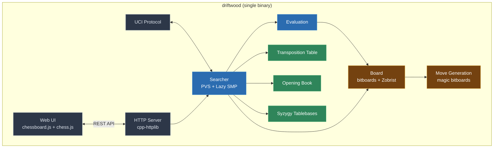
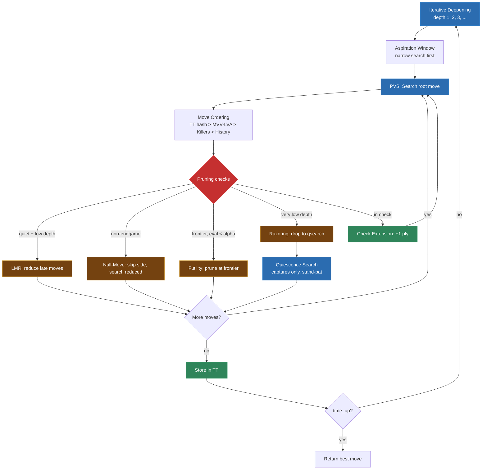
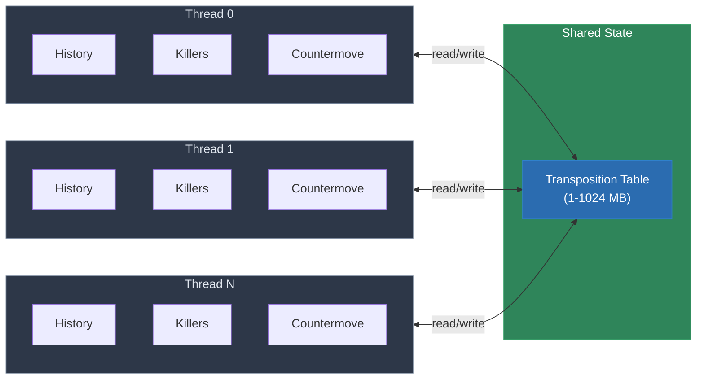

<p align="center">
  
</p>

<h1 align="center">DriftWood</h1>

<p align="center">
  A chess engine with a built-in web UI. Play in your browser, no setup beyond one binary.
</p>

<p align="center">
  <a href="#quick-start">Quick Start</a> ·
  <a href="#play-now">Play Now</a> ·
  <a href="#engine-internals">Internals</a> ·
  <a href="#contributing">Contribute</a>
</p>

<p align="center">
  
  
  
  
</p>

---

A ~2400 ELO chess engine written in C++17. Single binary, no dependencies, no internet required. Built-in web UI with drag-and-drop play, clock, move history, and live eval. Connect it to any UCI GUI. Multi-threaded search, Syzygy tablebases, opening book, the works.

**Why another chess engine?** Most serious engines are CLI-only and require a separate GUI. DriftWood ships one binary that speaks UCI, has a web UI baked in, and has a clean enough codebase to read, learn from, and hack on.



## Play Now

```bash
git clone https://github.com/akorite/driftwood.git
cd driftwood
cmake -B build -S . -DCMAKE_BUILD_TYPE=Release
cmake --build build -j$(nproc)
./build/driftwood serve
```

Open **http://localhost:8080**, pick a side, play.

<p align="center">
  
</p>

### Web UI Features

| | |
|---|---|
| Drag-and-drop with legal move indicators | Clock with 1 / 3 / 10 / 30 minute presets |
| Move history in SAN (click to jump back) | Captured pieces display |
| Live evaluation + depth readout | Board flip (`F`), new game (`N`) |

Everything is vendored under `web/vendor/`. Works fully offline, no CDN, no `npm install`.

## Engine Internals

DriftWood is a real chess engine, not a toy. It has the search techniques you'd find in competitive engines, implemented in ~4K lines of readable C++17.

### Search



### Evaluation

- Material + piece-square tables with middlegame/endgame interpolation
- Mobility (N, B, R, Q), king safety (pawn shield, attacker weights)
- Pawn structure: doubled, isolated, passed, backward, candidates
- Knight outposts, bishop pair, rook on 7th, space, threats
- Passed pawn king proximity

### Threading



**Lazy SMP**: multiple threads share one transposition table, each with private history/killers/countermover. Thread count configurable via UCI (`setoption name Threads value 4`).

### Extras

- **Opening book**: 321 entries, weighted random selection
- **Syzygy tablebases**: WDL/DTZ probing for 6-7 man endgames
- **Time management**: adaptive budgeting per clock tier, depth caps per budget

## UCI Options

| Option | Type | Default | Description |
|--------|------|---------|-------------|
| `Hash` | spin | 64 | Transposition table size (MB) |
| `Threads` | spin | 1 | Search threads |
| `SyzygyPath` | string | | Path to Syzygy tablebase files |
| `BookFile` | string | `books/driftwood.bin` | Opening book path |
| `BookMoves` | spin | 12 | Maximum book moves |

## HTTP API

The web UI is backed by a simple REST API. Use it to build your own frontends or integrate DriftWood into anything.

| Method | Endpoint | Description |
|--------|----------|-------------|
| GET | `/api/new_game?color=white\|black\|random` | Start a new game |
| POST | `/api/move` | Send a move, get engine reply |
| GET | `/api/state?fen=<FEN>` | Legal moves, check/mate status |
| GET | `/api/eval?fen=<FEN>&depth=N` | Evaluation with PV line |

## CLI

```bash
./build/driftwood                    # UCI mode (default)
./build/driftwood serve [port]       # Web UI on :8080
./build/driftwood perft 5            # Move generator verification
./build/driftwood bench 12           # Benchmark (nodes/sec)
./build/driftwood selfplay 20        # Engine vs. itself
```

## Tests

```bash
cd build && ctest --output-on-failure
```

54+ tests covering move generation, evaluation correctness, search tactics, TT behavior, Lazy SMP determinism, and SEE.

## Building

```bash
cmake -B build -S . -DCMAKE_BUILD_TYPE=Release
cmake --build build -j$(nproc)
```

**Requirements:** C++17 (GCC 9+ / Clang 10+ / MSVC 2019+), CMake 3.16+. That's it. No Boost, no external libs. GoogleTest is fetched automatically for the test suite.

**Cross-platform:**
- **Linux / macOS**: `gcc` / `clang`
- **Windows**: MSVC or MinGW

## Contributing

Contributions welcome. Bug fixes, evaluation tuning, new pruning ideas, test positions, docs.

See [CONTRIBUTING.md](CONTRIBUTING.md) for setup, code style, and PR checklist. Open an issue or discussion before large changes.

## License

MIT
