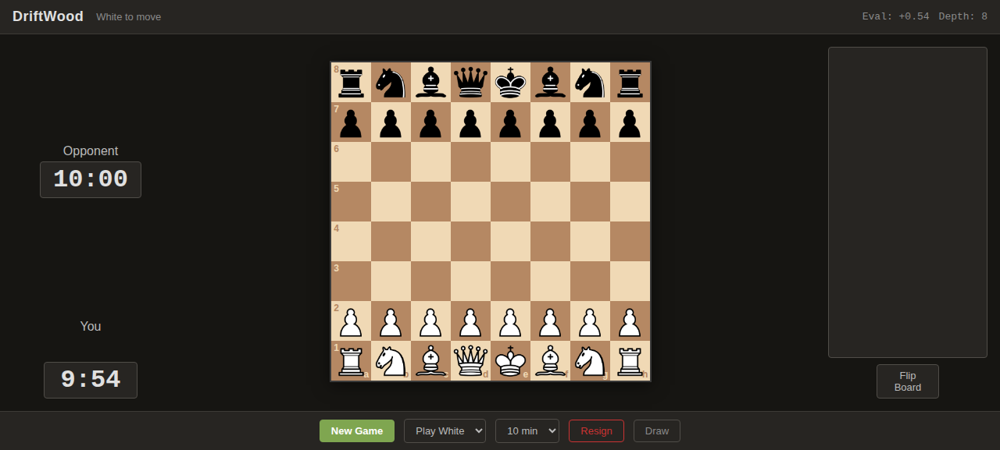
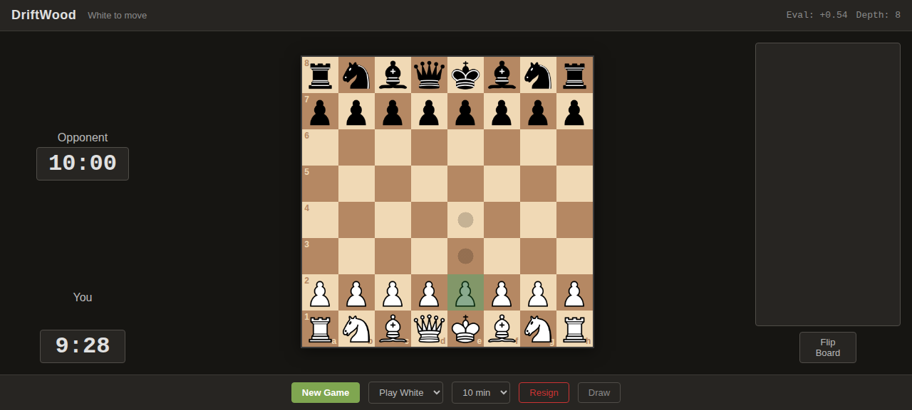

# DriftWood

A chess engine written in C++17. Around 2300-2500 ELO, single binary, has a web UI you can play against in your browser.

```
./driftwood serve
```

Open your browser, pick a side, play.



## Building

```bash
cmake -B build -S . -DCMAKE_BUILD_TYPE=Release
cmake --build build -j$(nproc)
```

Requires C++17 (GCC 9+ or Clang 10+) and CMake 3.16+.

## Playing

**Web UI:**

```bash
./build/driftwood serve           # http://localhost:8080
./build/driftwood serve 9090      # custom port
```

**UCI mode (for chess GUIs like CuteChess or Banksia):**

```bash
./build/driftwood                 # UCI mode (default)
echo "uci" | ./build/driftwood    # pipe commands directly
```

## The Web UI



- Drag-and-drop pieces with legal move dots
- Clock with 1, 3, 10, and 30 minute presets
- Move history in SAN, clickable to jump back
- Captured pieces display
- Live evaluation updated every few seconds
- Keyboard shortcuts: `N` new game, `F` flip board, `Esc` close modal

Everything is vendored under `web/vendor/` and works offline.

## Engine

**Search** - Principal Variation Search with iterative deepening and aspiration windows. Uses LMR, null move pruning, futility pruning, razoring, IIR, LMP, check extensions, and quiescence search.

**Evaluation** - Material, piece-square tables, mobility, king safety, pawn structure, outposts, bishop pair, rook placement, space, threats, and passed pawn king proximity.

**Threading** - Lazy SMP. Multiple threads share one transposition table. Configure with `setoption name Threads value 4`.

**Opening book** - 321 entries covering common lines. Weighted random selection for variety.

**Syzygy tablebases** - WDL/DTZ probing for 6-7 man positions.

## CLI

```bash
./build/driftwood perft 5                    # node count at depth 5
./build/driftwood perft 4 <fen> --split      # per-move breakdown
./build/driftwood perftsuite                 # run all perft positions
./build/driftwood bench 12                   # benchmark
./build/driftwood selfplay 20                # engine vs itself
```

## UCI Options

| Option | Type | Default | Description |
|--------|------|---------|-------------|
| `Hash` | spin | 64 | TT size in MB |
| `Threads` | spin | 1 | Search threads |
| `SyzygyPath` | string | - | Tablebase path |
| `BookFile` | string | books/driftwood.bin | Opening book |
| `BookMoves` | spin | 12 | Max book moves |

## HTTP API

| Endpoint | Method | Description |
|----------|--------|-------------|
| `/api/new_game?color=white\|black\|random` | GET | New game |
| `/api/move` | POST | Send move, get reply |
| `/api/state?fen=<FEN>` | GET | Legal moves, check/mate status |
| `/api/eval?fen=<FEN>&depth=N` | GET | Evaluation with PV |

## Tests

```bash
cd build && ctest --output-on-failure
```

## Perft

| Depth | Nodes |
|-------|-------|
| 1 | 20 |
| 2 | 400 |
| 3 | 8,902 |
| 4 | 197,281 |
| 5 | 4,865,609 |

## License

MIT
